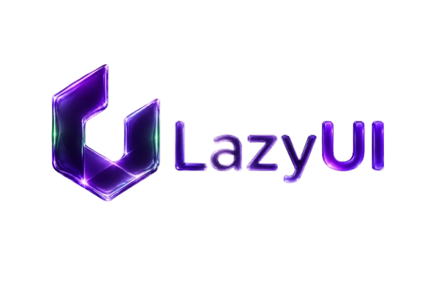
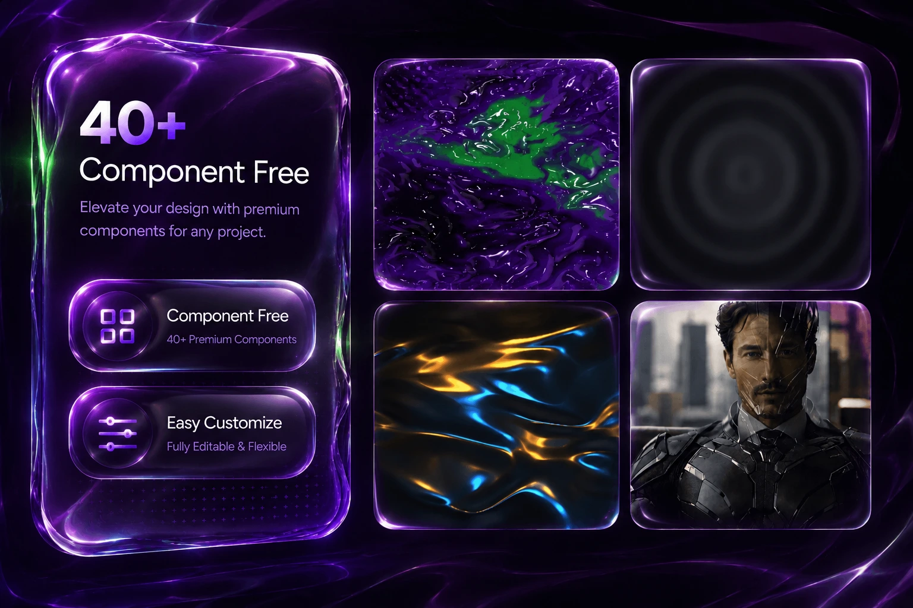

<p align="center">
  
</p>

<div align="center">
  <table>
    <tr>
      <td>
        <a href="https://www.producthunt.com/products/lazy-ui?embed=true&amp;utm_source=badge-featured&amp;utm_medium=badge&amp;utm_campaign=badge-lazy-ui" target="_blank" rel="noopener noreferrer"></a>
      </td>
      <td style="border: none; background: transparent;">
        <a href="https://unikorn.vn/p/2lazy-ui?ref=embed-2lazy-ui" target="_blank"></a>
      </td>
    </tr>
  </table>
</div>
<p align="center">
  A premium, motion-forward component library for React 19, Next.js 16, and Tailwind CSS v4. Clean, highly interactive, and fully compatible with shadcn/ui.
</p>
<p align="center">
  <a href="https://github.com/zivhdinfo/lazy-ui">
    
  </a>
  <a href="./LICENSE">
    
  </a>
</p>

<p align="center">
  
</p>


## Features
*   **40+ High-Fidelity Components** — Carefully crafted text animations, interactive backgrounds, and UI primitives with new additions weekly.
*   **Pre-Built Blocks** — 5+ fully responsive page sections, with a roadmap targeting 50+ layouts.
*   **Zero-Bloat Architecture** — Engineered with minimal, tree-shakeable dependencies to keep bundle sizes clean.
*   **Total Source Control** — Fully customizable components that you can tweak via props or modify the source code directly.
*   **Frictionless Setup** — Copy-paste ready compatibility with modern React, Next.js, and Tailwind CSS v4.
---

## Installation

```bash
npx shadcn@latest add https://2lazyui.com/r/matrix-grid.json
```

---

## Creator

*   **Zivhd** — creator & maintainer.

---

## Credit

Lazy UI stands on the shoulders of these incredible libraries and tools:
*   [motion](https://motion.dev/) — Declarative React animations
*   [GSAP](https://gsap.com/) — High-performance interactive timelines
*   [Three.js](https://threejs.org/) & [@react-three/fiber](https://r3f.docs.pmnd.rs/) — WebGL scene integrations
*   [Radix UI](https://www.radix-ui.com/) — Accessible unstyled primitives
*   [shadcn/ui](https://ui.shadcn.com/) — Outstanding component registry architecture

---

## License

This project is licensed under the MIT License - see the [LICENSE](./LICENSE) file for details.
